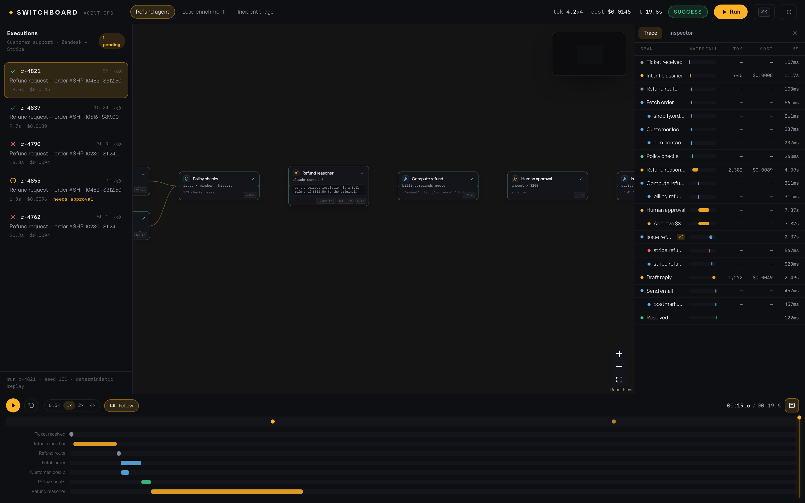
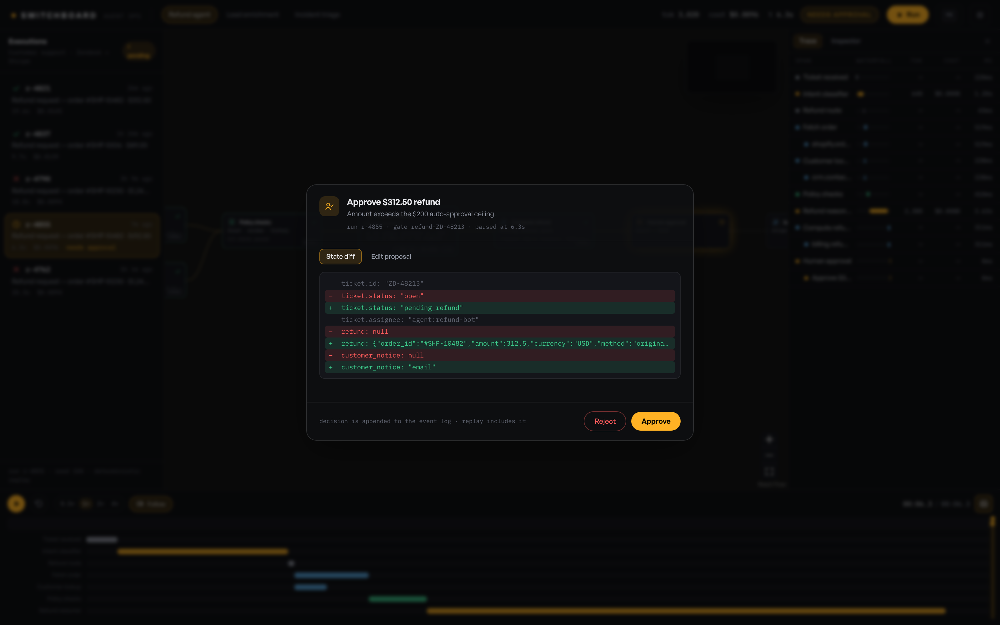
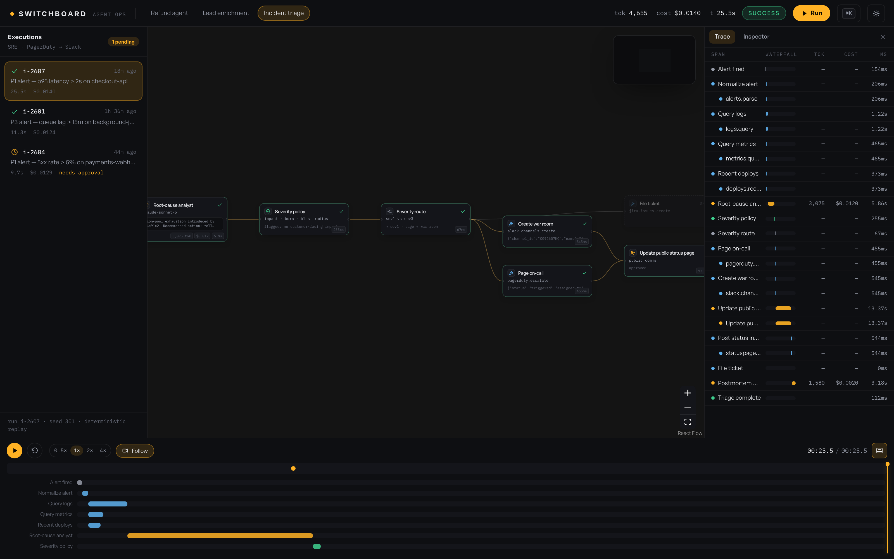
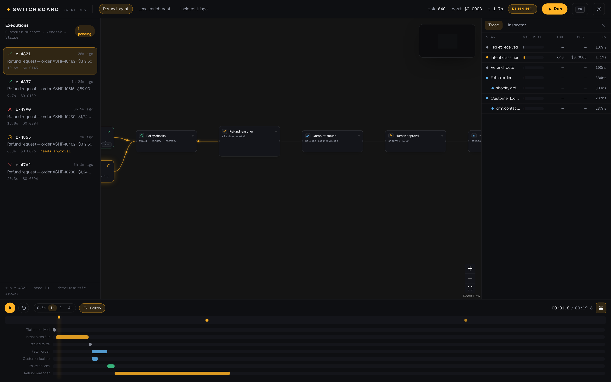
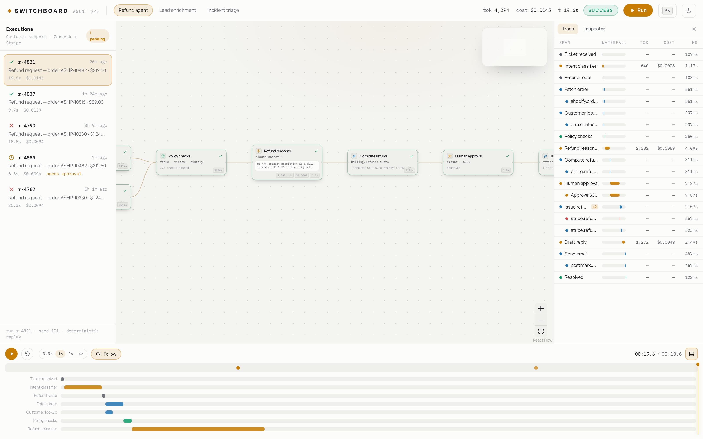
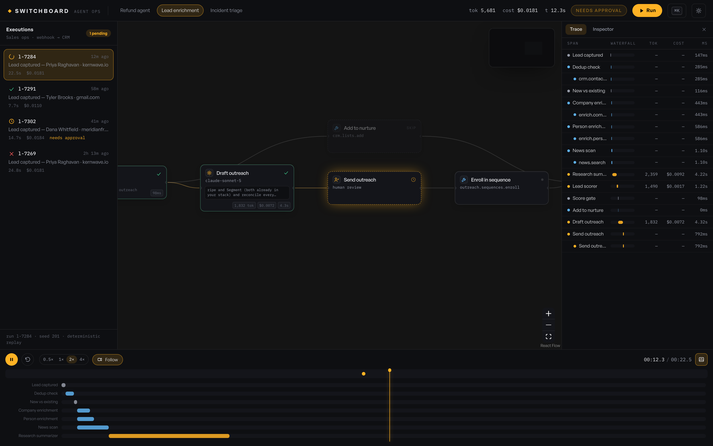
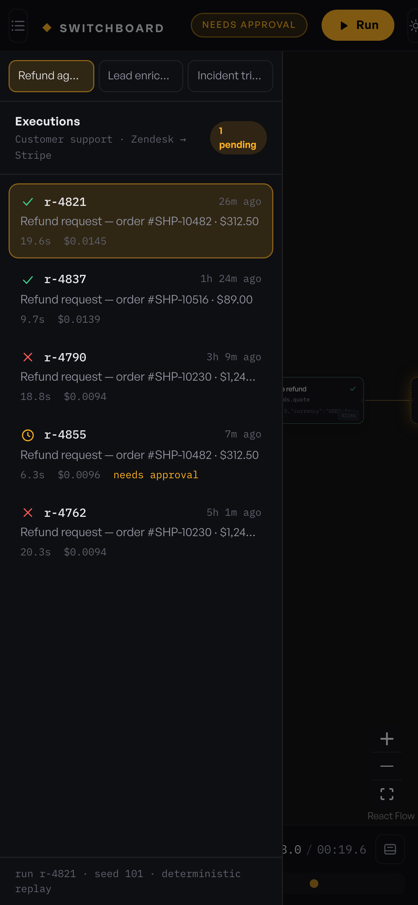

# SWITCHBOARD

**A control room for AI agent workflows.** Watch a multi-step agent pipeline execute on a
node canvas — tokens streaming, costs ticking, tools failing and retrying — pause it at a
human-approval gate, edit the proposed action in Monaco, and replay the whole run from one
deterministic event log. Frontend-only, synthetic data, no backend.



The demo is aimed at one job: showing what the **observability half** of an AI-agent
product should feel like. Builders (n8n, Langflow, Flowise) are everywhere; the
run-visibility layer — traces, replay, cost attribution, human-in-the-loop — is where
product craft is scarce. That's the part this demo builds.

| | |
| --- | --- |
|  |  |
|  |  |
|  |  |

## Stack

- **React 19 + TypeScript (strict) + Vite 7**
- **@xyflow/react 12** — node canvas; custom nodes and packet-animated edges
- **elkjs** — layered DAG auto-layout (lazy-loaded, it's 1.4 MB)
- **Monaco** — JSON editing in the approval gate, bundled locally (no CDN)
- **GSAP** — modal choreography; **Zustand** — state; **cmdk / sonner** — palette & toasts
- **Tailwind CSS 4** — theming via CSS variables, light + dark

## Run it

```bash
npm install
npm run dev        # http://localhost:5173
npm run build      # strict tsc + vite build → dist/
npm run preview    # serve the production build

npm run qa         # Playwright suite against the preview server (port 4174)
npm run shots      # regenerate docs/screenshots
```

No env vars, no services. `npm run preview -- --port 4174` first if running QA.

### Debug URL params

| param | effect |
| --- | --- |
| `?scenario=refund\|lead-enrichment\|incident-triage` | open a scenario |
| `?run=<id>` | select a run from history (e.g. `r-4855`) |
| `?t=<ms>` | seek the playhead |
| `?play=1` | start playback |
| `?modal=1` | open the pending approval modal |
| `?theme=light` | force theme |

## Architecture — one event log, five views

The core decision: **a run is an append-only event log**, and every view is a pure
function over `(events, playheadMs)`.

```
                        ┌────────────────────────────────────────┐
 scenario script  ──►   │  RunEvent[]  (deterministic, seeded)   │
 (seed, variant,        │  run.start · node.start/end · llm.chunk│
  decisions)            │  tool.call/result · node.retry         │
                        │  gate.open/close · edge.flow · run.end │
                        └───────────────┬────────────────────────┘
                                        │ pure selectors (O(n) folds)
        ┌──────────────┬────────────────┼──────────────┬───────────────┐
        ▼              ▼                ▼              ▼               ▼
   node canvas    Gantt lanes     trace waterfall   cost/token     approval
   (statuses,     (timeline       (spans, retries,  HUD (ticking   modal (open
   streams,       dock)           tokens, cost)     via rAF)       gate at T)
   packets)
```

- **Simulation**: scenario scripts call a builder API (`llm()`, `tool()`, `router()`,
  `approval()`, `parallel()`…) that emits events with realistic timing — LLM nodes stream
  word-group chunks at 38–68 tok/s after a first-token delay, tools take roughly
  150–800 ms with jitter, retries back off exponentially. All randomness comes from one seeded mulberry32 PRNG:
  **same (scenario, seed, variant, decisions) ⇒ byte-identical log**. The QA suite
  asserts this on every run in history.
- **Approval gates** work by re-simulation: an unanswered `approval()` stops the script
  and the run is `waiting`. Approving/editing/rejecting appends a decision and regenerates
  the log — which now flows *through* the gate. Replay of an approved run replays the
  decision too. Editing the proposal in Monaco feeds the edited state back into the
  script (an edited refund amount changes the Stripe call's arguments downstream).
- **Playback** is two-tier: an rAF clock mutates a `playhead` object outside React;
  60 fps consumers (HUD numbers, timeline playhead) read it in their own rAF loops, while
  React re-renders are driven by an ~12 Hz quantized tick. Pausing stops re-renders
  entirely — equal-value zustand updates are dropped.
- **Packets on edges are log-driven**, not fire-and-forget CSS: `edge.flow` events carry
  a time window, packet position derives from the playhead, so scrubbing backwards moves
  packets backwards too.
- **Cost figures reconcile**: `cost = tokens × per-1M pricing table`, accumulated
  per-node and summed in the HUD — every dollar on screen can be re-derived from visible
  token counts.

### Scenarios (all synthetic, no real APIs)

1. **Refund agent** — Zendesk ticket → classification → parallel order/CRM fetch →
   policy checks → reasoning → `$312.50` refund gated behind human approval → Stripe call
   that eats a 429 and retries → reply drafting → send. Variants: under-ceiling
   auto-approval, and a disputed charge where the refund fails even after approval.
2. **Lead enrichment** — webhook → dedup → parallel Clearbit/person/news enrichment →
   summarizer → scorer → high-score leads get a drafted outreach gated behind approval;
   low scores go to nurture.
3. **Incident triage** — PagerDuty alert → parallel logs/metrics/deploys evidence →
   root-cause analysis citing shas and log counts → severity policy → sev1 pages on-call,
   opens a war room and gates the public status-page update; sev3 files a ticket.

Scope guard (by design): **no drag-and-drop graph editing.** Graphs are pre-authored;
the demo's value is execution visualization, replay and product feel — not an n8n clone.

## Design notes

Dark control-room chrome with a warm amber accent (deliberately not purple-on-dark),
Cabinet Grotesk / General Sans / IBM Plex Mono (bundled locally, licenses in
`public/fonts/LICENSES.txt`), elevation via lighter surfaces instead of shadows, 1px
white/7% borders, tabular numerals on every data cell, translucency reserved for floating
chrome (modal, palette, banner). Micro-interactions: 150–250 ms transitions, spring-free
easings, `⌘K` palette, kbd chips, toasts. Light theme included.

## QA

`npm run qa` — 26 Playwright checks, all passing:

- zero console errors at 360/390/768/1440 px; no horizontal overflow anywhere
- engine determinism audit (byte-identical logs, all 9 scenario-variants terminate,
  history covers success/failed/waiting/rejected)
- approve → run resumes; reject → run stops as rejected; live runs auto-pause at gates;
  Monaco loads from the local bundle; edited proposals apply
- replay advances, seek works, ⌘K switches scenarios, light theme applies,
  trace span click opens the inspector payload
- mobile: approval modal usable, executions sheet opens

All screenshots ≤ 4000×4000.

## Honesty notes

- Every run, model reply, tool response and metric is **synthetic and generated
  locally** by a deterministic simulator. No model is called; labels say "detected",
  never "AI-powered".
- The per-token pricing table is a plausible snapshot for demo purposes.
- No backend, no analytics, no network requests at runtime.

## Deployment

Static SPA (`dist/`) — any static host. For `switchboard.k1ngp1n.com`: build command
`npm run build`, output `dist`, no rewrites needed (single route). Long-cache
`assets/**` and `fonts/**` (hashed / immutable), no-cache `index.html`. Fully
self-contained — a strict CSP works:
`default-src 'self'; style-src 'self' 'unsafe-inline'; worker-src 'self'`
(the boot shell and Monaco inject inline styles, hence `'unsafe-inline'`; the
production build spawns Monaco workers from same-origin asset files — verified in
`dist/`, no `blob:` needed).
